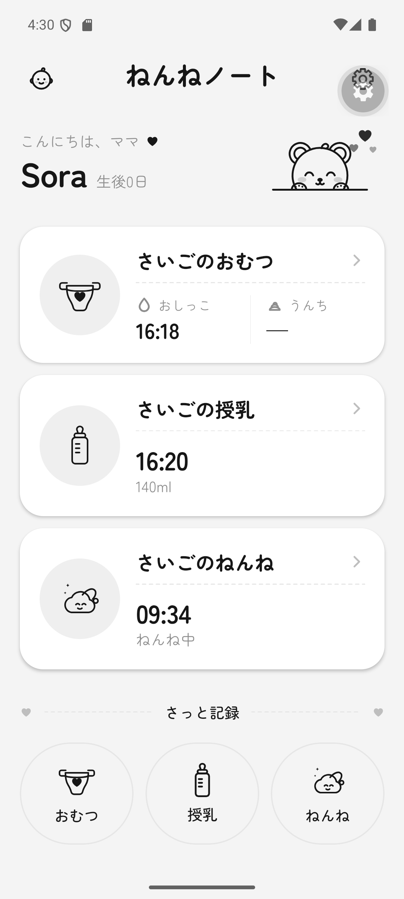
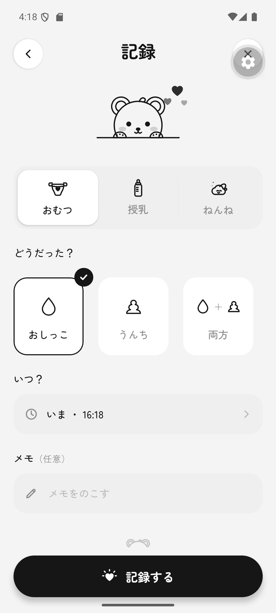
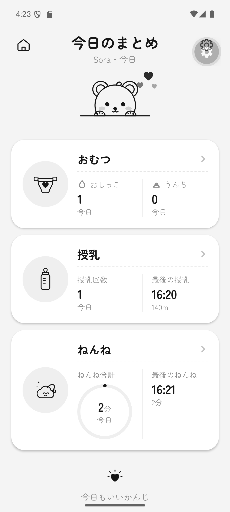
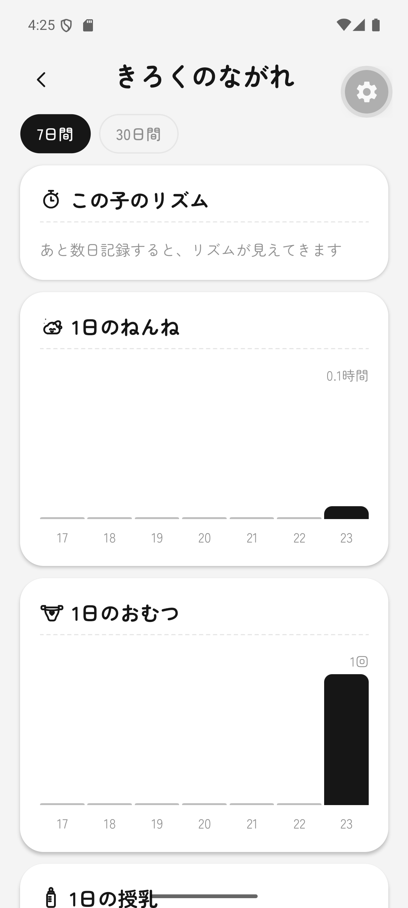
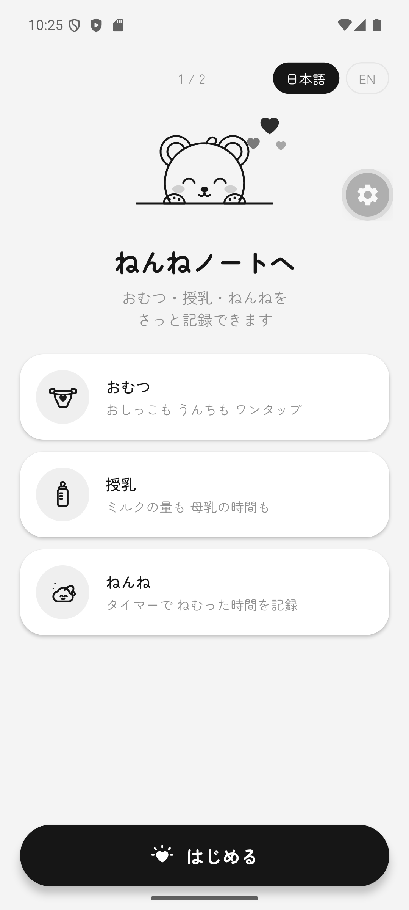
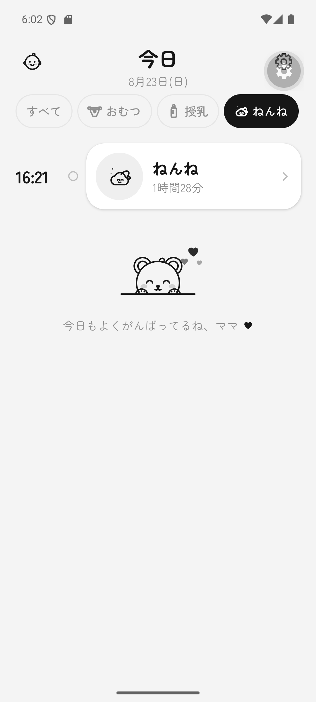
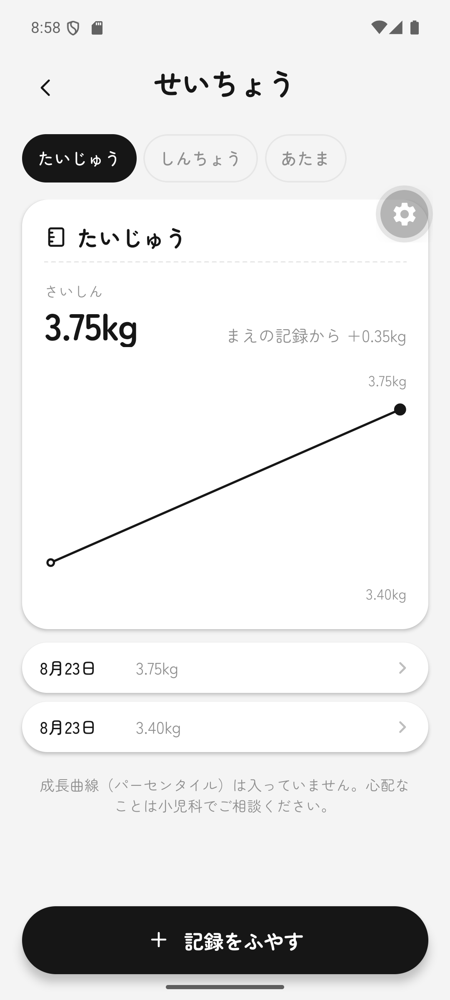
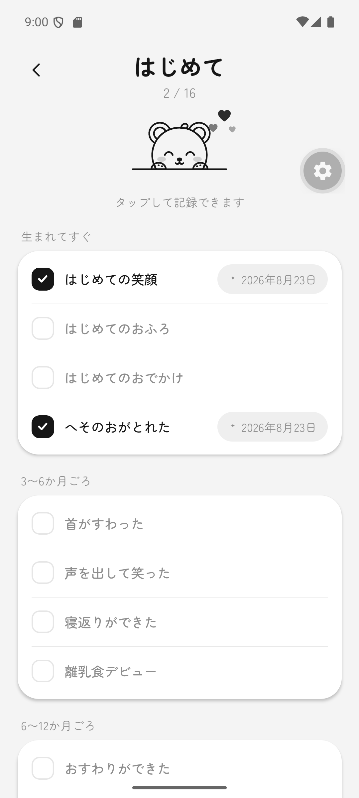
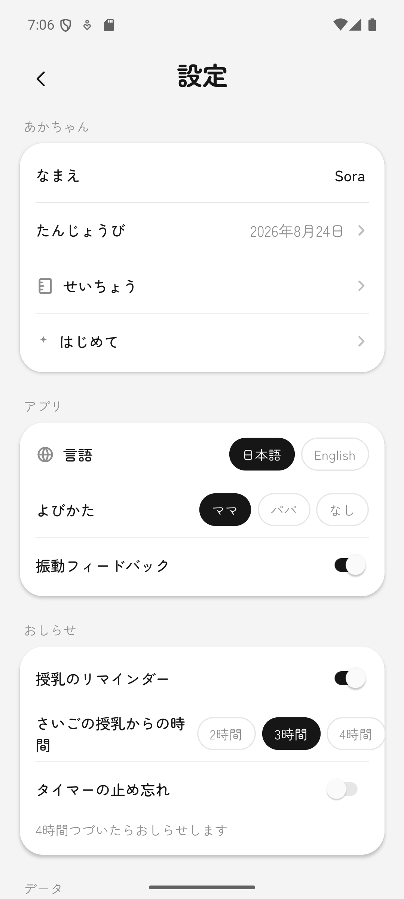
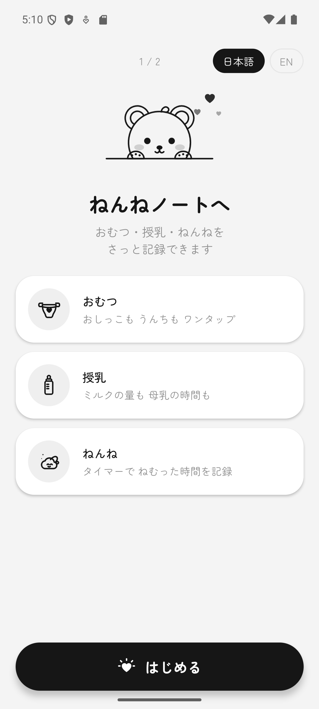

<h1 align="center">ねんねノート — Nenne Note</h1>

<p align="center">
  A baby log that gets out of the way.<br>
  Diapers, feeds and sleep — logged in two taps, at 3am, one-handed.
</p>

<p align="center">
  <a href="https://github.com/RobTar97/nenne-note/actions/workflows/ci.yml"></a>
  <a href="LICENSE"></a>
  
  
  
  
</p>

<p align="center">
  
  
  
  
</p>

---

## What it is

A parent uses this one-handed, in the dark, with a baby in the other arm. Every
decision in the codebase serves that.

- **No account, no network, no cloud.** Everything lives in a local SQLite
  database. Nothing about a baby ever leaves the device.
- **Two taps to log something.** Anything that adds a step to that is the wrong
  feature, however good it is.
- **Japanese first**, English optional — both written natively, not translated.
- **Strictly monochrome.** The personality comes from hand-drawn line art and
  motion, never from colour.

It is a finished app rather than a demo: migrations, reduced-motion handling,
i18n, haptics, local notifications, and a release build you can install.

## Screens

| | |
|---|---|
| **Onboarding** | An animated welcome with three feature cards, then the baby's name and birthday. Runs once. |
| **Home** | Greeting, age, the last diaper / feed / sleep, and quick-add. Shows a live timer in place of the last-event value while a session is running. |
| **Quick log** | Diaper kind, bottle volume, nursing side, time, note. Doubles as the editor and as the live-session controls. |
| **Today** | A filterable timeline of the day. Tap a row to edit it. |
| **Daily summary** | Per-category totals and a sleep ring. |
| **Trends** | 7- and 30-day charts, plus the baby's own rhythm. |
| **Growth** | Weight, height and head circumference over time. |
| **Firsts** | A 16-item milestone checklist grouped by rough age band. |
| **Settings** | Baby details, language, how you are addressed, haptics, reminders. |

<p align="center">
  
  
  
  
  
</p>

## Quick start

```bash
git clone https://github.com/RobTar97/nenne-note.git
cd nenne-note
npm install
npx expo start --android    # or --ios
```

Everything the app uses works in **Expo Go**, so there is nothing to build to
try it. The one exception is reminders — see below.

```bash
npm run typecheck    # tsc --noEmit
npx expo-doctor      # project health
```

---

## How it works

```
app/                 expo-router routes, one file per screen
src/
  design/            tokens · type · motion · timeline   — the whole visual system
  icons/             hand-authored SVG line art + the PeekBear mascot
  components/        Txt, Press, Card, Segmented, FilterPills, Ring, BarChart, LineChart …
  data/              the milestone catalogue
  db/                schema (migrations) · repo (queries) · stats (derived) · live (hook)
  i18n/              ja.ts (primary) · en.ts · duration formatting
  notifications/     reminder scheduling
  store/             AppProvider — settings, baby, haptics
  utils/             time, useTicker
```

### Logging model

- **Diaper** — an instant: pee, poop or both.
- **Bottle** — an instant with a volume in ml, entered on a stepper with presets
  so it can be driven one-handed and cannot produce an invalid number.
- **Nursing** — a live session. Start it, switch sides, stop it. Time accrues
  per side and is flushed on every switch, so it cannot be lost.
- **Sleep** — a live session with a single start and stop.

A running session is just an `entry` row with `ended_at IS NULL`, so it survives
the app being killed with no separate "current timer" state to reconcile.
Verified: start a nap, force-stop the app, relaunch — it is still counting.

**Only one session runs at a time.** Starting a nap closes a running feed and
vice versa: a baby cannot be asleep and nursing at once.

**Editing never rewrites what the form did not show.** An edit patches the start
time, the note, and the one field belonging to that entry's kind — never
`ended_at` (which would collapse a nap to zero length) and never `feed_kind`
(which would rewrite a nursing session as a bottle).

### Data

`expo-sqlite`, local only.

Migrations live in `src/db/schema.ts`, tracked with `PRAGMA user_version`. Append
new ones, never edit a shipped one, and keep each re-runnable (`IF NOT EXISTS`)
— `user_version` only advances after a migration completes, so one interrupted
halfway is retried from the top on next launch.

Screens read through `useLive()`, which re-runs its query when one of the tables
it declares changes. A save on one screen refreshes every other screen; there is
no cache to invalidate.

Statistics are derived from raw entries on read, never stored, so editing or
deleting a log cannot leave a stale total behind. Sleep crossing midnight is
split by overlap, so both days get their real share. The rhythm figures use
**medians**, not means — one four-hour car journey should not move what a parent
reads as "normal for us".

### Growth and firsts

Measurements are stored as integers (grams, millimetres) and shown in the units
you read off the scale. The chart appears from the **second** reading onwards:
one point is not a trend, and a plot whose minimum equals its maximum reads as a
broken chart.

**No percentile curves are included, deliberately.** Reference growth curves are
clinical data, and shipping an approximation of them in an app a new parent
reads at 3am would be worse than shipping nothing. The screen says so and points
at a paediatrician.

Milestone age bands are headings only — nothing is ever shown as "due" or
"late". A parent measuring their child against a schedule is precisely the
anxiety this app should not create.

### Reminders

Two local notifications, derived from the database rather than from state of
their own: a **feed** nudge 2/3/4 hours after the last feed started, and a
**forgotten timer** nudge after four hours. Both off by default, asking for
permission at the moment they are switched on rather than at launch.

They are rescheduled from scratch on every write, so a reminder cannot outlive
the log that justified it — a nudge saying the baby is due a feed, an hour after
they were fed, is worse than no nudge.

> [!IMPORTANT]
> **Reminders need a development or production build.** `expo-notifications`
> throws from its *import* in Expo Go — Android push support was removed there
> in SDK 53, and the module refuses to load even though this app only ever
> schedules local notifications. It is therefore loaded lazily and every entry
> point degrades to a no-op; in Expo Go the toggles explain this rather than
> failing silently.

### Design system

Strictly monochrome, so there is no palette to keep consistent and nothing to
get wrong in a rush.

- **`src/design/tokens.ts`** — colour, radius, a 4pt spacing scale, shadow, hit
  targets.
- **`src/design/type.ts`** — Zen Maru Gothic at three weights. Tracking is
  size-specific (large Latin numerals tighten, Japanese sits at 0) and leading
  is generous, because Japanese needs more room than Latin at the same size.
- **`src/design/motion.ts`** — curves, durations, springs, momentum helpers.
- **`src/design/timeline.ts`** — the authored-timeline primitive.

Icons are authored by hand in a 24×24 grid with one rounded pen of constant
real-world width, so a 20px chevron and a 46px category mark read as the same
drawing. The mascot's silhouette is geometrically derived — its ear and head arc
endpoints are the true circle–circle intersections — so it stays clean at any
size.

### The mascot



`src/icons/PeekBear.tsx`. Hand-drawn SVG, and — with `alive` — actually alive:

- **Breathing.** A 1.4% scale with `transformOrigin` pinned to the ledge, so the
  bear rises and settles while the line it leans on stays put.
- **Peeking.** It rests with closed happy eyes and every 4–8 seconds opens them,
  looks, and closes again. Both expressions are always mounted and cross-faded
  through `animatedProps`, so a peek is an opacity change on the UI thread
  rather than a re-render. The interval is **randomised** — a mascot on an exact
  metronome stops reading as alive and starts reading as a loading spinner.
- **Tap it** and it peeks on demand.
- **Celebration.** On a saved log or a ticked milestone the bear hops and the
  hearts lift and fade, each trailing the last.

`alive` is off by default. Most placements are decoration on a screen that is
doing something else, and a character moving in the corner of a screen you are
trying to read is noise. The hearts stay still at rest for the same reason.

<br clear="right">

### Motion rules this codebase follows

1. **Frequency gates the animation.** Home is opened dozens of times a day, so
   it has no entrance animation at all. Onboarding is seen once, ever, so it is
   the only screen with a staggered entrance.
2. **Nothing animates on the JS thread.** Press feedback and every transition
   run on shared values; no gesture or scroll handler calls `setState`.
3. **Only `transform` and `opacity`,** with one deliberate exception: the Today
   filter indicator and the chart bars are absolutely positioned and childless,
   so animating their size costs no layout for anything else — and keeps the
   corner radius a scale would smear.
4. **A finger means a spring; everything else is a curve.** Bounce only where
   the gesture carried momentum.
5. **Reduced motion ships with the animation,** never as a follow-up.
6. **One haptic per commit,** never as the only feedback, and always at the
   causal moment rather than when the animation ends.
7. **Screen transitions are the platform's,** never rebuilt in JS. Under reduced
   motion they become a cross-fade.
8. **Multi-element entrances run off one authored clock**
   (`src/design/timeline.ts`), not a pile of independent delays.

### Performance

Measured, not guessed: measure, fix one thing, re-measure.

**Found:** a live query re-ran on *every* database write regardless of table.
One saved log triggered 7 query executions, including `getSettings` and
`getBaby` — which read tables the insert never touched, and whose freshly-built
objects changed the app-wide context value and re-rendered every screen
consuming it.

**Fixed:** `useLive` now takes the tables it reads. Same save: **7 → 5**
executions, and settings/baby no longer churn the context.

**Measured and left alone:** re-renders of a mounted screen during an edit and
save came to 2 — its own query plus one context update. Not a storm, so the
obvious next move (splitting the celebration token into its own context) was
*not* made.

**Cold-start TTI**, release build, `am start -W`:

| Launch | TotalTime |
|---|---|
| First ever (assets unpacking) | 2911 ms |
| Subsequent cold starts | 1126 ms, 923 ms |

Inside the < 2s budget after the first run. Emulator numbers — treat as a smoke
test rather than a device figure.

---

## Building

### A test APK, locally

```bash
npx expo prebuild --platform android
cd android
./gradlew assembleRelease -PreactNativeArchitectures=arm64-v8a
# -> android/app/build/outputs/apk/release/app-release.apk
```

**Pass `-PreactNativeArchitectures=arm64-v8a`.** Without it Gradle packs all
four ABIs into one universal APK: **119 MB versus 52 MB**. Every current Android
phone is arm64.

The generated `android/` directory is disposable and git-ignored — it is rebuilt
from `app.json` by `prebuild`, so native config belongs in `app.json` and its
config plugins, never in the generated files.

> [!WARNING]
> `release` is signed with the **debug keystore** (the React Native template
> default). Fine for a test install, not fine for the Play Store — generate a
> real upload key first. The build also inherits
> `android.permission.SYSTEM_ALERT_WINDOW` from a dependency; block it with
> `android.blockedPermissions` in `app.json` before publishing.

### EAS, for distribution

```bash
npm i -g eas-cli && eas login
eas build --platform android --profile preview      # installable APK
eas build --platform android --profile production   # AAB for Play
eas build --platform ios --profile production       # needs an Apple account
eas update --branch production -m "..."             # JS-only, no store review
```

---

## Status

Working and installable. Known gaps, all deliberate or flagged:

- **The app icon and splash are still the Expo template.** The top item before
  anyone else sees a build.
- No growth percentile curves (see above).
- One baby, one device. The schema keeps a `baby` table with a foreign key from
  every row, so twins or a second child can be added without a migration.
- **Motion feel is unverified on real hardware.** Spring settle, velocity
  handoff and haptic timing cannot be judged from an emulator. Before calling
  the motion done, run a release build on the slowest Android device you
  support.

## Contributing

Contributions are welcome — please read [CONTRIBUTING.md](CONTRIBUTING.md)
first, especially [what this project is](CONTRIBUTING.md#what-this-project-is).
Some things (cloud sync, accounts, analytics, colour) are deliberate boundaries
rather than missing features.

Translations are particularly welcome: copy `src/i18n/en.ts`, translate, and
register it. The dictionary is typed, so the compiler tells you what you missed.

By taking part you agree to the [Code of Conduct](CODE_OF_CONDUCT.md).
Security issues go through [SECURITY.md](SECURITY.md), never a public issue.

## Licence

[MIT](LICENSE) © Robert Tarczynski

### Third-party

- **Zen Maru Gothic** — [SIL Open Font License 1.1](https://openfontlicense.org/),
  via [`@expo-google-fonts`](https://github.com/expo/google-fonts). Bundled at
  three weights.
- All icons and the mascot are original work for this project, drawn as SVG
  paths — no icon set is vendored.
- The four images in `design/screens/` are the original design mockups this app
  was built from.

### Acknowledgements

The motion approach draws on Apple's *Designing Fluid Interfaces* and on Emil
Kowalski's writing about interface craft. The authored-timeline technique in
`src/design/timeline.ts` was informed by studying
[Appllama's welcome-screen collection](https://github.com/Appllama/top-welcome-screens)
— **no code was copied from it**: that project is GPL-3.0 and its screens
deliberately imitate other companies' branding, so it was read for technique
only, and everything here is an independent implementation in this app's own
design language.
